<br>
<br>
<br>
<br>
<br>
<br>
<br>
<br>

# G-Force measurement
## A simple CPU with SPI interface

<br>
<br>

 Dominik Socher  
 27.02.2021  

<br>
<br>

This report describes an embedded system. The system logs acceleration data from a sensor (ADXL345) and presents the data in form of dots on a VGA-screen. The sensor measures the X/Y/Z axis in relation gravity. The hardware consists of a simple processor which follows a program stored in ROM. A program counter points on the memory address. The ROM outputs 20 bit of data whereof  4-bit are CPU instructions and the remaining 16 bits are ADXL345 instructions. Another component of the system is a co processor for the serial master interface (SPI). This co processor controls the SPI and supervised its timing. The sensor outputs 8 bit of data which are low and high byte of a corresponding axis. The co processor samples these 8 bit of data and combines them to 16 bit of data which now consist the whole axis value. The data gets send to the CPU where it gets stored by the CPU to a RAM. The VGA interface reads that RAM and computes data to the screen.

<br>
<br>
<br>
<br>
<br>
<br>
<br>
<br>
<br>
<br>
<br>
<br>
<br>
<br>

<br>
<br>
<br>

## Table of contents
* [1 General info](#1-general-info)
* [2 System architecture](#2-system-architecture)
* [2.1 System flow](#2.1-system-flow)
* [2.2 Input and Output](#2.2-input-and-output)
* [2.3 Package and library](#2.3-package-and-library)
* [3 Components](#3-components)
* [3.1 Input filter](#3.1-input-filter)
* [3.2 CPU](#3.2-CPU)
* [3.2.1 Function](#3.2.1-function)
* [3.2.2 Finite state machine](#3.2.2-finite-state-machine)
* [3.2.3 Program ROM](#3.2.3-program-rom)
* [3.3 Graphic processor](#3.3-graphic-processor)
* [3.3.1 Function and state machine](#3.3.1-function-and-state-machine)
* [3.4 VGA Controller](#3.4-vga-controller)
* [3.4.1 VGA_Sync](#3.4.1-vga_sync)
* [3.5 SPI controller](#3.5-spi-controller)
* [3.5.1 Statemachine and function](#3.5.1-statemachine-and-function)
* [4 TIMING](#4-TIMING)
* [5 Verification](#5-verification)
* [5.1 Case 1](#5.1-case-1)
* [5.2 Case 2](#5.2-case-2)
* [5.3 Case 3](#5.3-case-3)
* [5.4 Case 4](#5.4-case-4)
* [5.5 Case 5](#5.5-case-5)
* [6 Analysis](#6-analysis)

<br>
<br>
<br>
<br>
<br>
<br>
<br>
<br>
<br>
<br>
<br>
<br>
<br>
<br>
<br>


<br>
<br>
<br>

## 1 General info
This project is the examination project of the TEIS VHDL system course. 
This repository consists of the raw VHDL files.

## 2 System architecture
The system uses the Intel Altera FPGA circuit MAX 10 and the accelerometer ADXL345 and a VHLD soft system.
The accelerometer controller consists of a input filter, CPU called accelerometer controller, a VGA graphic generator, a VGA controller and a SPI controller. All five sub components will be discussed in the following chapters. The following figure gives an overview of the system.
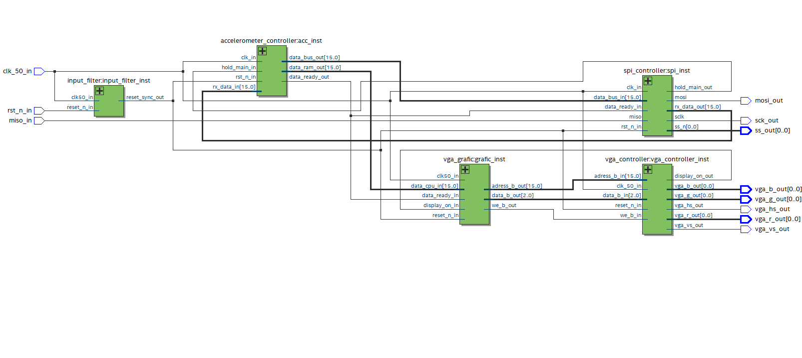

### 2.1 System flow
The system uses a ROM where the program instructions are saved for booth the accelerometer controller and the SPI controller. The program instructs the CPU to following behavior. See following figure.

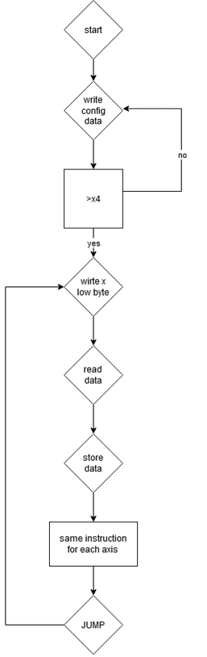

### 2.2 Input and Output
The following table shows the I/O of the system
Name | Type | Description
------------ | ------------- | -------------
clk_50_in | INPUT | 50 MHz system clock
rst_n_in | INPUT | Reset active low, asynchronous 
vga_vs | OUTPUT | Vertical sync VGA
vga_hs | OUTPUT | Horizontal sync VGA
vga_r | OUTPUT | Color red
vga_g | OUTPUT | Color green
vga_b | OUTPUT | Color blue
miso_in | INPUT| SPI data input 
mosi_out | OUTPUT | SPI data output
sck_out | OUTPUT | Serial clock
ss_out | OUTPUT | SLave select

### 2.3 Package and library
The project uses the following VHDL library's and packages

* IEEE - contains the standard package for datatype and operations
* STD_LOGIC_1164 - contains std_logic_types and related functions
* NUMERIC_STD - contains mathematical instructions

The is project was created in Quartus v. 18.1 and simulated in Model Sim.

## 3 Components
This chapter describes all the sub components of the system.

### 3.1 Input filter
* Component name : input_filter
* Instance name : input_filter_inst

The input filter synchronizes the asynchronous reset input with two D-type-flip-flops to the system clock. The following table shows the components input.

Name           | Description
-------------  | -------------
clk_50_in      | Input for system clock
reset_n_in     | reset active low asynchronous
reset_sync_out | Synchronized reset output

The following figure shows the resistor transfer level of the component.

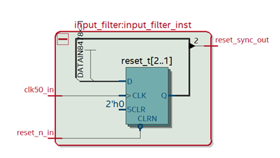

## 3.2 CPU
The main CPU of the system is called accelerometer_controller. The processor is the main driver for the system and controls the data flow between the SPI part. Furthermore, has the CPU the capability to save data into RAM.

* Component name : accelerometer_controller
* Instance name : acc_inst

The following table shows the components I/O.

Name           | Description
-------------  | -------------
clk_in         | Input for system clock
rst_n_in       | reset active low 
data_bus_out   | 16-bit data instruction
data_ram_out   | RAM data output
data_ready_out | Ready flag to SPI
hold main_in   | Stall signal for CPU
rx_data_in     | Data input from SPI

The following figure shows the RTL of the CPU

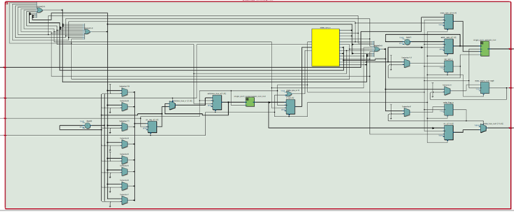

#### 3.2.1 Function
The Cpu is clock via the system clock. The finite state machine can execute five assembler instructions.

* NOP
* READ
* WRITE
* STORE
* JUMP

It uses a program pointer to point at given address data in the ROM. A instructions is stored in ROM.
Data which is getting read stores in a RAM via the STORE instruction.
READ means the CPU is latching ingoing data. The WRITE instruction writes instructions out to the SPI component. NOP is no operation.

The processor works in three or four phases (see following figure). The first phase is the fetch phase in which the next instructions is getting fetched from the ROM. The phase is divided to four clock cycles to prevent data loss. In the first cycle the program counter gets allocated to the ROM address. Cycle two eventually clears flags. In cycle three and four the instructions are getting assigned. 
The next phase is the decode phase in which the CPU checks what to execute. The phase is divided into two cycles to prevent data loss. The first cycle increments the program counter and the second one decodes which assembler instruction to execute.
The next phase is the execution phase in which the assembler instruction is getting executed.

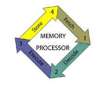

### 3.2.2 Finite state machine
The processor consists of 13 states total. The next figure gives an overview of the transitions. 

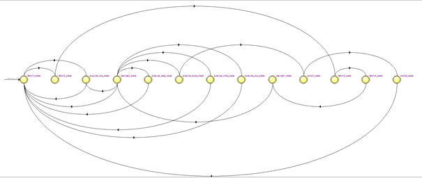

* Fetch 1
If hold_main_in low the state allocates the program counter to the address bus. If high the processor executes NOP.
* Fetch 2
Clearing of flags write_flag and data_ready.
* Fetch 3
Allocate bit 3 to 0 from ROM data bus to the instruction register.
* Fetch 4
Allocate bit 19 to 4 from ROM data bus to data register.
* Decode 1
Increment program counter.
* Decode 2
Decoding instruction register and execute the corresponding assembler. Instruction
* Execute NOP
No operation -> back to fetch 1.
* Execute write
Write data fom data register to output port.
* Execute read
Read incoming data and latch it to RAM data bus.
* Execute store
Transition to store 1 state
* Store 1
Increment RAM address bus by one and set write enable bit.
* Store 2
Reset write enable bit.
* Execute jump
Jump to address register six.

### 3.2.3 Program ROM
The instructions and the data that the CPU executes och sends are stored inside a ROM. The first instruction is empty data send to the SPI unit to ensure SPI timing protocol. The following table gives an overview of the memory content. The content is in hexadecimal

Address  | Machine code | Instruction | Assembler code | Data | ADXL345
------  | --------- | --------- | --------- | --------- | --------- |
0 | 00001 | 1 | WRITE | 0000 | -
1 | 2d0b1 | 1 | WRITE | 2d0b | Power control
2 | 2c0f1 | 1 | WRITE | 2c0f | BW rate
3 | 31ac1 | 1 | WRITE | 31ac1 | Data format
4 | b2001 | 1 | WRITE | b2001 | X low byte
5 | 00002 | 2 | READ | 0000 | -
6 | 00003 | 3 | STORE | 0000 | -
7 | b3001 | 1 | WRITE | b300 | X high byte
8 | 00002 | 2 | READ | 0000 | -
9 | 00003 | 3 | STORE | 0000 | -
10 | b4001 | 1 | WRITE | b400 | Y low byte
11 | 00002 | 2 | READ | 0000 | -
12 | 00003 | 3 | STORE | 0000 | -
13 | b5001 | 1 | WRITE | 0000 | Y high byte
14 | 00002 | 2 | READ | 0000 | -
15 | 00003 | 3 | STORE | 0000 | -
16 | b6001 | 1 | WRITE | b600| Z low byte
17 | 00002 | 2 | READ | 0000 | -
18 | 00003 | 3 | STORE | 0000 | -
19 | b7001 | 1 | WRITE | b700| Z high byte
20 | 00002 | 2 | READ | 0000 | -
21 | 00003 | 3 | STORE | 0000 | -
22 | 00004 | 4 | JUMP | 0000| -

## 3.3 Graphic processor
* Component name : vga_grafic
* Instance name : grafic_inst

The following table shows the components I/O

Name           | Description
-------------  | -------------
clk_in         | Input for system clock
rst_n_in       | reset active low 
data_cpu_in   | 16-bit data input for pixel data
we_b_out | write enable to video ram
data_b_out | data to video ram
adress_b_out | address bus to video ram
display_on_in | display time vga

### 3.3.1 Function and state machine
The component calculates the actual x/y/z position. The state machine processes the data and sends it as a 3-bit vector in combination with the video RAM address to the VGA controller. The state machine is a simple machine which is getting initialized by the data ready signal from the main CPU. The following figure shows the state machine.

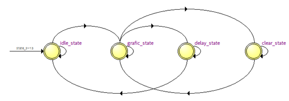

* IDLE 
wait for ready signal
* GRAPHIC
send pixel data to vga controller. 
* DELAY
delay state
* CLEAR
clear screen

## 3.4 VGA Controller
* Component name : vga_controller
* Instance name : vga_controller_inst

The VGA controller consists of three sub components 
* PLL 25 MHZ
* dual port RAM
* vga_sync

The following figure shows the VGA controller.

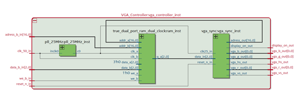

### 3.4.1 VGA_Sync
* Component name : vga_sync
* Instance name : vga_sync_inst

The component reads pixel data from the RAM and prints it out to the screen. Below is the code that describes the behavior of the component

```
LIBRARY ieee;
USE ieee.std_logic_1164.ALL;
USE ieee.numeric_std.ALL;

ENTITY vga_sync IS
    GENERIC (
        --horizontal timing 
        h_pixel_g         : INTEGER := 640;
        h_frontporch_g    : INTEGER := 16;
        h_sync_g          : INTEGER := 96;
        h_backporch_g     : INTEGER := 48;
        --vertikal timing
        v_pixel_g         : INTEGER := 480;
        v_frontporch_g    : INTEGER := 10;
        v_sync_g          : INTEGER := 2;
        v_backporch_g     : INTEGER := 33;
        --rgb data width
        colorwidth_g      : INTEGER := 4;
        --adress width
        addrwidth_g       : INTEGER := 17
    );
    PORT (
        clk25_in          : IN STD_LOGIC;
        reset_n_in        : IN STD_LOGIC;
        data_in           : IN STD_LOGIC_VECTOR (2 DOWNTO 0);
        vga_vs_out        : OUT STD_LOGIC;
        vga_hs_out        : OUT STD_LOGIC;
        vga_r_out         : OUT STD_LOGIC_VECTOR (colorwidth_g - 1 DOWNTO 0);
        vga_g_out         : OUT STD_LOGIC_VECTOR (colorwidth_g - 1 DOWNTO 0);
        vga_b_out         : OUT STD_LOGIC_VECTOR (colorwidth_g - 1 DOWNTO 0);
        adress_out        : OUT STD_LOGIC_VECTOR (addrwidth_g - 1 DOWNTO 0);
        display_on_out    : OUT STD_LOGIC
    );
END vga_sync;

ARCHITECTURE rtl OF vga_sync IS

    CONSTANT x_period_c       : INTEGER := h_pixel_g + h_frontporch_g +  h_sync_g + h_backporch_g; -- max. number x axis
    CONSTANT y_period_c       : INTEGER := v_pixel_g + v_frontporch_g + v_sync_g + v_backporch_g; -- max. number y axis
    CONSTANT hs_out_value_1_c : INTEGER := h_pixel_g + h_frontporch_g;
    CONSTANT hs_out_value_2_c : INTEGER := h_pixel_g + h_frontporch_g + h_backporch_g - 1;
    CONSTANT vs_out_value_1_c : INTEGER := v_pixel_g + v_frontporch_g;
    CONSTANT vs_out_value_2_C : INTEGER := v_pixel_g + v_frontporch_g + v_backporch_g;

    SIGNAL counter_x_s : INTEGER RANGE 0 TO x_period_c - 1 := 0;
    SIGNAL counter_y_s : INTEGER RANGE 0 TO y_period_c - 1 := 0;

BEGIN
    --Counter process -------------------------
    PROCESS (clk25_in, reset_n_in)
    BEGIN
        IF (reset_n_in = '0') THEN
            -- clear counter signals
            counter_x_s <= 0;
            counter_y_s <= 0;
        ELSIF rising_edge(clk25_in) THEN
            -- x_counter
            IF (counter_x_s >= x_period_c - 1) THEN --x_period clk cycle for x
                counter_x_s <= 0;
                -- y_counter
                IF (counter_y_s = y_period_c - 1) THEN --y_period clk cycle for y
                    counter_y_s <= 0;
                ELSE
                    counter_y_s <= counter_y_s + 1; -- increment y axis
                END IF;
            ELSE
                counter_x_s <= counter_x_s + 1; -- increment x axis
            END IF;
        END IF;
    END PROCESS;

    --Sync pulses ----------------------------------------
    vga_hs_out <= '0' WHEN ((counter_x_s >= hs_out_value_1_c) AND (counter_x_s <= hs_out_value_2_c)) ELSE
        '1';
    vga_vs_out <= '1' WHEN ((counter_y_s > vs_out_value_1_c) AND (counter_y_s <= vs_out_value_2_C)) ELSE
        '0';

    --Display time
    display_on_out <= '1' WHEN (counter_x_s < h_pixel_g) OR (counter_y_s < v_pixel_g) ELSE
        '0';

    --address out--calculation for 320*240-----------------
    adress_out <= STD_LOGIC_VECTOR(to_unsigned(counter_y_s/2 * 320 + counter_x_s/2, adress_out'length));
    --RGB signals out -------------------------------------
    vga_r_out <= "1" WHEN data_in = "001" ELSE
        (OTHERS => '0');
    vga_g_out <= "1" WHEN data_in = "010" ELSE
        (OTHERS => '0');
    vga_b_out <= "1" WHEN data_in = "100" ELSE
        (OTHERS => '0');
END rtl;
```
<br>

## 3.5 SPI controller
* Component name : spi_controller
* Instance name : spi_controller_inst
 
 The SPI controller consist of a SPI master and a co processor. The SPI master is an IP by [DIGIKEY](https://www.digikey.com/eewiki/pages/viewpage.action?pageId=4096096)

The following table gives an overview of the I/O

Name           | Description
-------------  | -------------
clk_in | system clock
rst_n_in | reset active low
data_bus_in | 16 bit data input
miso | master in slave out
data_ready_in | data ready signal
sclk | serial clock
ss | slave select
mosi | master out slave in
hold_main_out | stall main cpu
rx_data_out | caputred miso data

### 3.5.1 State machine and function
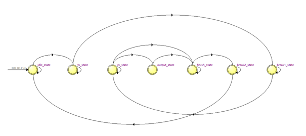

The state machine processes SPI data and controls the system so the SPI master can stay inside SPI timing parameters. Furthermore, guards the machine the spi master.

* IDLE 
After the reset increments a counter to give the spi master time to get ready. If there is ny data from the CPU the machine transits to TRANSMIT
* Transmit
In this state the SPI master gets activated and set to continuos mode. The main processor gets paused. IF the master is not active data is getting send to the master.
* RECEIVE
The state fill the rx buffer first low byte then high byte to get valid data. The ADXL345 sends data in two clock cycles each 8 bit wide.
* OUTPUT
16-bit data writes to the output port
* FINISH
When in this state the machine succeeded transmit 16 bit of data to the cpu
* BREAK
Pause of 200 ns between transactions
	
## 4 TIMING
The timing got verified with the following sdc code

```
#sdc file acceleration_probe
#take care of time uncertainty
derive_clock_uncertainty

#system clock 50 MHz
create_clock -name clk_50_in -period 20.000 [get_ports {clk_50_in}]
#vga clock 25 MHz
derive_pll_clocks -create_base_clocks

#set min max time for inputs
set_input_delay -clock { clk_50_in } -min 0.7 [get_ports {rst_n_in}]
set_input_delay -clock { clk_50_in } -max 3.15 [get_ports {rst_n_in}]

set_input_delay -clock { clk_50_in } -min 0.7 [get_ports {miso_in}]
set_input_delay -clock { clk_50_in } -max 3.15 [get_ports {miso_in}]

#min max time for outputs

set_output_delay -clock { clk_50_in } -min 1 [get_ports {vga_b_out[0] vga_g_out[0] vga_hs_out vga_r_out[0] vga_vs_out}]
set_output_delay -clock { clk_50_in } -max 2.05 [get_ports {vga_b_out[0] vga_g_out[0] vga_hs_out vga_r_out[0] vga_vs_out}]

set_output_delay -clock { clk_50_in } -min 1 [get_ports {mosi_out sck_out ss_out[0]}]
set_output_delay -clock { clk_50_in } -max 2.05 [get_ports {mosi_out sck_out ss_out[0]}]
```
The system passed the timing test. The following tables show the worst slack/hold times.

Setup time | SLACK
------ | ------
clk_50 | 8.937
vga_clk | 32.048

Hold time | SLACK
------ | ------
clk_50 | 0.242
vga_clk | 0.570

## 5 Verification

The test protocol is presented in the following table. The system passed all tests. To simulate MISO data this test stimulus is used.

```
	MISO_TEST : process(sck_out)
	variable MISO_TEST : std_logic_vector(15 downto 0) := x"AABB";
	variable i : integer := 15;
	begin
		if rising_edge(sck_out) THEN
			miso_in <= MISO_TEST(i);
			i := i -1;
			if i = 0 THEN
				i := 15;
			end if;
		end if;
	end process MISO_TEST;
```

Case | Description | Acceptance | Verification
------ | ------ | ------ | ------ 
1 | reset 1 to 0 | reset system | yes
2 | hold main = 1 | execute nop | yes
3 | New data to SPI | transition data ready -> new data latches in | yes
4 | MISO test stimulus | MISO data should pulse | yes
5 | Send data when 16-bit full | Buffer fills in two clock cycles | yes

### 5.1 Case 1
The following figure shows the passed test. After reset low the system got reset.

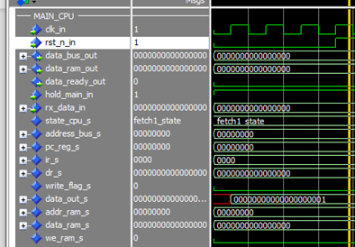

<br>

### 5.2 Case 2
In case 2 the cpu executes NOP as long as hold_main is high. See figures

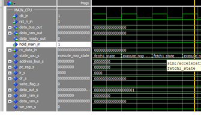

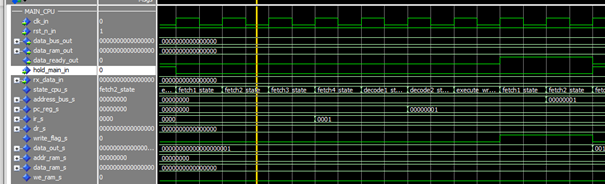

### 5.3 Case 3
The following figure shows that new data laches into the data bus when data ready is high.

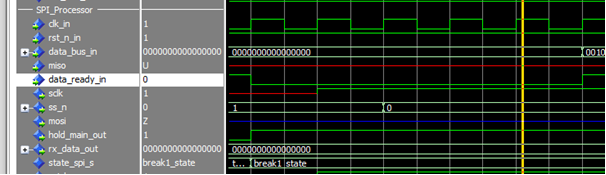

### 5.4 Case 4
The test stimulus for MISO should pulse during a transaction. See following figure.

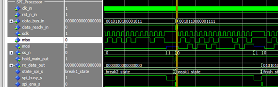

### 5.5 Case 5
When the rx buffer holds 16-bit of data the data gets send.

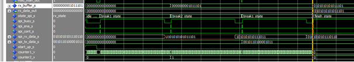

## 6 Analysis

The whole system is downloadable to the MAX 10 FPGA circuit. The table below gives detailed information about the resources.

Resource | Amount
------ | ------
logical element | 617 / 49,760 (1%)
register | 315
pins | 11 / 360 (3%)
memory bits | 204544 / 1677312 (12%)
PLL | 1 / 4 (25%)
total effect | 161-13 mW
